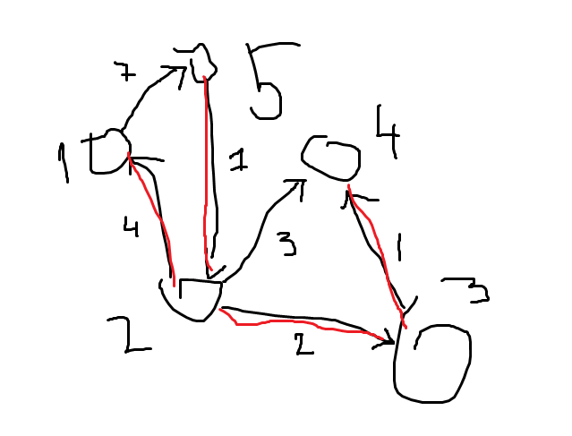

# Data Structures in C++
Implementing different data structures and algorithms in C++

## Content
 - Trie
 - Disjoint Set
 - Graph

## Examples
### Kruskal's algorithms

```cpp
DataStructures::Graph<int> graph;
graph.InsertEdge(1, 5, 7);
graph.InsertEdge(2, 1, 4);
graph.InsertEdge(2, 4, 3);
graph.InsertEdge(2, 3, 2);
graph.InsertEdge(3, 4, 1);
graph.InsertEdge(5, 2, 1);

auto tree = graph.GetMinimalSpanningTree();
for (auto& edge : tree) {
    cout << edge->from->value << " - " << edge->to->value << endl;
}
```

### Result
```
3 - 4
5 - 2
2 - 3
2 - 1
```

